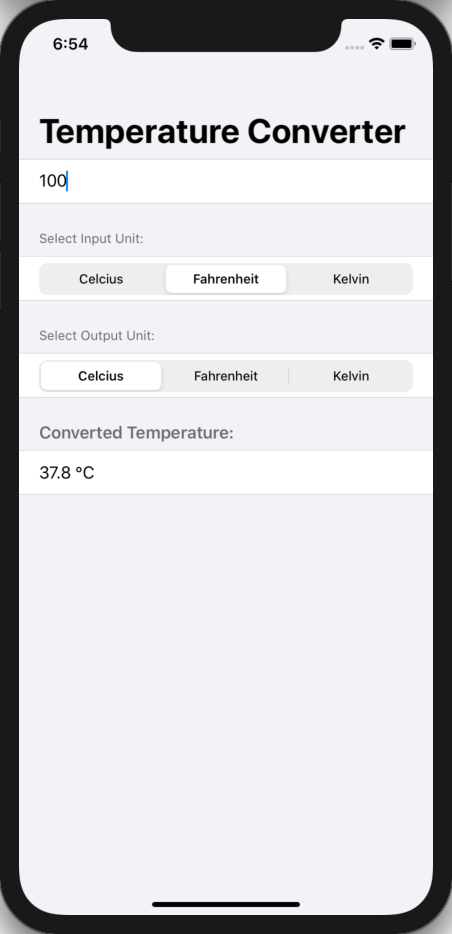

# 100 Days of SwiftUI Project 2

## Temperature Converter App

**App Description:**  Simple app to Convert the temperature from/to Celcius, Fahrenheit and Kelvin.

**Swift Features Used:**
View constructs such as NavigationView, Form, Section, Segmented Picker, TextField, Text. @State property wrapper, and binding with $.

**Screenshots:**

